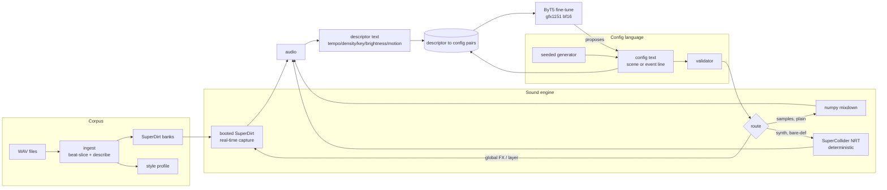

# Architecture

The system is one loop, built in stages. A *config* — a sentence of the
project's grammar — flows rightward into audio; a *descriptor* — a
compact text describing audio — flows leftward into the model. The live
agent (US3, next) closes the circle.



## The one-engine principle

The renderer used to make training data is the *same SuperDirt* the live
agent will play through. A model trained on offline renders of a
different engine would learn a different instrument. That decision
(design-change-001) forces real-time capture into the dataset path — and
everything else follows from making that fast, deterministic where
possible, and honest where not.

## The config language (grammar v3)

One versioned lark grammar
([`grammar/pattern_subset.lark`](https://github.com/lambdasistemi/wav2tidal/blob/main/grammar/pattern_subset.lark))
is the single syntactic source of truth shared by the generator, the
validator, and (eventually) the grammar-constrained decoder. It has
three entry points:

- `mini` — Tidal mini-notation (`bd:3 ~ [sn sn] hh*2`), interpreted by
  one scheduler shared by every renderer.
- `line` — a full event line: sources + `# param value` controls.
- `scene` — the primary composition unit since design-change-002:

```text
scene voice supersaw # note -12 # lfo 0.5
      mod cutoff sine 800 600 0.25 mod resonance ramp 0.2 0.6
      voice superhammond:3 # vibrato 0.5 mod room walk 0.4 0.3 0.5 7
      layer d1 $ s "bd(3,8)" # gain 0.9
```

A scene is 1–4 sustained voices; each `mod` moves one parameter along a
shape (`ramp`, `sine`, `walk`, `steps`) over time. Semantics — parameter
ranges, per-synth applicability, what is modulatable — live in one table
([`core/pattern/params.py`](https://github.com/lambdasistemi/wav2tidal/blob/main/src/wav2tidal/core/pattern/params.py)),
derived from the SuperDirt sources and documented with provenance in
[`contracts/params-v2.md`](https://github.com/lambdasistemi/wav2tidal/blob/main/specs/001-corpus-to-live-pipeline/contracts/params-v2.md).
See **[Language](language.md)**.

## Module map (pure core / impure shell)

```text
src/wav2tidal/
├── core/                 PURE — no IO, fully CI-tested
│   ├── pattern/          grammar, params table, shapes, trajectory
│   │                     sampler, scene/line types, generator+mutation,
│   │                     validator, renderer mapping (dirt.py), repair
│   ├── render/           mini-notation scheduler + numpy slice mixdown
│   ├── dsp/              slicing, features (tempo/key/onsets/motion)
│   └── descriptor/       style-profile types
├── io/                   THE SHELL — file/audio/process edges
│   ├── superdirt.py      sclang script builders + NRT/RT renderers
│   ├── banks.py wav.py   SuperDirt bank layout, WAV IO
│   └── embedder.py       CLAP (opt-in) / handcrafted-only default
├── pipeline/             ingest, style profile, dataset generation
└── train/                data split, validity metrics, ByT5 loop
```

The split is load-bearing: every musical decision (what is valid, what a
shape means, what a config renders as) is pure and property-tested on
CPU; the shell only executes plans. CI runs the pure surface; two local
smoke gates (`just smoke-audio`, `just smoke-gpu`) guard the hardware
edges.

## Rendering: route by fidelity

A config may only go to a renderer that realizes **every** control it
sets — a mismatch would produce training pairs whose description doesn't
match their text (silent mislabeling, the worst dataset bug). The router
([`core/pattern/dirt.py`](https://github.com/lambdasistemi/wav2tidal/blob/main/src/wav2tidal/core/pattern/dirt.py))
picks the cheapest faithful path:

| path | what | properties |
|---|---|---|
| `mix` | sample lines with gain/speed/pan only | pure numpy, byte-deterministic, CI-safe |
| `nrt` | synth voices + bare-def params + FX chains | headless `Score.recordNRT`, byte-deterministic (seeded RNG) |
| `rt` | global FX (reverb/delay), sample layers | booted SuperDirt, full chain, tolerance-reproducible |

Scenes build their own synth graphs (voices on private buses, per-voice
`dirt_*` FX chained in SuperDirt's module order, known node handles), so
trajectories can be automated: `n_set` score rows in NRT — fully
deterministic — and scheduled ticks in RT. Renders are peak-normalized
to −1 dBFS. See **[Sound engine](sound-engine.md)** for the details and
the SuperDirt bugs found along the way.

## The dataset and the model

`config_dataset` samples seeded valid-by-construction configs (a
configurable scene/line mix), renders each through its routed path — NRT
in a thread pool, RT across a **fleet** of SuperDirt instances — then
describes the captured audio:

```text
tempo=122 density=mid key=C#m brightness=4/5 motion=rising
```

`motion` matters: it is the field that makes a filter *sweep*
describable, so the model can learn when to emit a `ramp` instead of a
constant. Pairs are written with their renderer and kind; the artifact
embeds the source inventory and an explicit reproducibility contract
(config text: byte-deterministic from the seed; mix/NRT audio:
byte-deterministic; RT audio: within tolerance).

ByT5-small (byte-level — never mangles `~ [ ] # :`) is fully fine-tuned
in bf16 on the gfx1151 GPU to map descriptor → config text. Generated
configs are validated by the same grammar+validator as everything else,
and near-valid outputs pass through
[`repair`](https://github.com/lambdasistemi/wav2tidal/blob/main/src/wav2tidal/core/pattern/repair.py)
(truncate voices, dedupe mods, clamp ranges) — the live loop's
send-safety layer. See **[Model](model.md)**.

## What "matching two sounds" means

Two mechanisms, deliberately different:

- **Sound ↔ sound** (scoring): every clip becomes a vector — a CLAP
  embedding (timbre/texture semantics) concatenated with handcrafted
  features (MFCC/chroma/tempo, the things CLAP encodes weakly). Match =
  cosine similarity. Ear-verified in US1: similar tracks rank above
  dissimilar ones.
- **Sound ↔ config** (the model): no direct comparison — both sides are
  projected into the shared descriptor language, and the model learns
  description → config. Live, the two compose: the model's config is the
  opening move; capture-and-cosine scoring judges it; evolution refines.

## Design history

The repo practices design-first development: substantial direction
changes are recorded as ADRs before implementation, and research claims
are verified against primary sources (the SuperDirt quark code, nixpkgs,
the hardware) with per-claim status in
[`research.md`](https://github.com/lambdasistemi/wav2tidal/blob/main/specs/001-corpus-to-live-pipeline/research.md).
Two pivots shaped the system:

1. **Sound-first** (design-change-001): timbre over rhythm; control real
   SuperDirt synths, full FX vocabulary, live capture authoritative.
2. **Parameter scenes** (design-change-002): compose in parameter space —
   Tidal scores the *parameters*, not the score.
