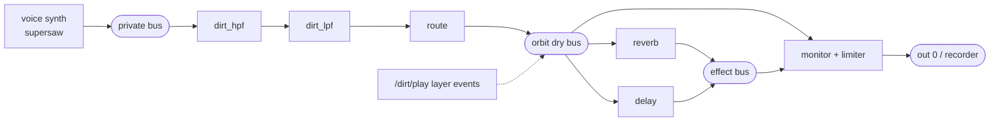

# Sound engine

All audio is produced by SuperCollider/SuperDirt — the same quark, the
same synthdefs, offline and live. This page explains the three render
paths, how scenes become synth graphs, the parallel fleet, and the
SuperDirt behaviours we had to engineer around (each verified on the box
and recorded in the
[R7 research addenda](https://github.com/lambdasistemi/wav2tidal/blob/main/specs/001-corpus-to-live-pipeline/research.md)).

## Three paths, one fidelity rule

| | `mix` | `nrt` | `rt` |
|---|---|---|---|
| engine | numpy | `scsynth -N` (no audio device) | booted SuperDirt |
| covers | sample lines, gain/speed/pan | synth voices, FX chains, **global reverb/delay** (#40) | sample layers; the live agent |
| reproducible | byte-exact | byte-exact (seeded) | within tolerance |
| speed | instant | ~3–4 s/render (sclang spawn) | wall-clock (audio plays in real time) |

The router refuses any assignment where a control would silently not
render — mislabeled training pairs are worse than slow renders.

## Scenes as synth graphs

A scene cannot ride SuperDirt's `/dirt/play` (SuperDirt spawns nodes
internally — nothing to automate against). Instead the renderer builds
the graph itself with known node handles:

- Per-voice `dirt_*` effect synths are chained **in SuperDirt's module
  order** (shape → hpf → bpf → crush → coarse → lpf → envelope), with the
  same one-namespace semantics (`resonance` reaches both the source def
  and the chained filter; a secondary param without its activator is
  inert, as in Tidal).
- **Trajectories** are sampled to timed knots
  ([`core/pattern/trajectory.py`](https://github.com/lambdasistemi/wav2tidal/blob/main/src/wav2tidal/core/pattern/trajectory.py)):
  ramps interpolate in log space for log-tagged params (a cutoff sweep is
  musical, not arithmetic), walks are seeded, steps repeat per cycle. In
  NRT these become `n_set` score rows — **deterministic automation**; in
  RT, scheduled ticks on the known nodes.
- Renders are peak-normalized to −1 dBFS (PCM_24 — a float WAV would get
  a timestamped PEAK chunk from libsndfile and break byte-determinism).

## The parallel fleet

NRT renders are independent processes: a thread pool (`max_workers`)
fans them out. RT renders are wall-clock-bound, so batches spread across
a **fleet** of SuperDirt instances (`fleet_size`), each with its own
scsynth port, SuperDirt OSC port, and PipeWire null sink (tracked and
unloaded by pactl module id). Measured: 40 hybrid items, fleet of 4 →
3.1 s/item vs 5.3 sequential; at corpus scale the boot cost amortizes
toward `fleet_size×`. A 100k-pair corpus is an overnight job.

## SuperDirt behaviours we engineered around

Everything below was diagnosed empirically (bus meters, `/n_trace`,
byte-level determinism checks, per-second envelopes) and is encoded in
the script builders with tests. The pause items are candidates for an
upstream report.

1. **Paused global-effect nodes never sound again after resume** (the
   bug *class*, two instances found):
   - the orbit's `dirt_delay` — created paused, silent forever after the
     event-driven resume. Workaround: spawn a fresh per-job delay with
     creation args (also guarantees an empty delay line per render).
   - `dirt_monitor` — pauses itself after 4 s of orbit silence
     (`DirtPause`), then every later render in the batch records zeros.
     Workaround: replace it at boot with an unpausable monitor
     (`In(dry)+In(effect) → Limiter → out`).
2. **NRT is nondeterministic until the server RNG is seeded** — a
   `RandSeed` synth at score time 0 makes noise-carrying defs
   (superkick's click, snares, hats) byte-identical across renders.
3. **`~dirt = (numChannels: 2)` never worked** — `Object.numChannels` is
   a real method returning 1, so every early NRT render compiled the
   defs mono. `~dirt = 0 ! 2` (an Array's `numChannels` is its size) is
   the correct fake.
4. **Default scsynth resources are too small for the broad palette** —
   GVerb-carrying defs (superprimes, supergrind, superwavemechanics)
   failed to load or crashed the server mid-batch until `numWireBufs =
   512` and `memSize = 128 MB`.
5. **Process hygiene**: sclang is run in its own process group and
   group-killed on timeout — an orphaned sclang holds UDP 57120 and
   poisons every later real-time run.

## Hardware gates

`just smoke-audio` runs five stages against real SuperCollider: NRT
determinism, RT capture with FX tail, multi-event NRT with noise defs,
batch rendering with the delay workaround, and scene automation
(byte-identical NRT + an audible RT cutoff sweep). It is local-only by
design — CI never needs an audio stack.
